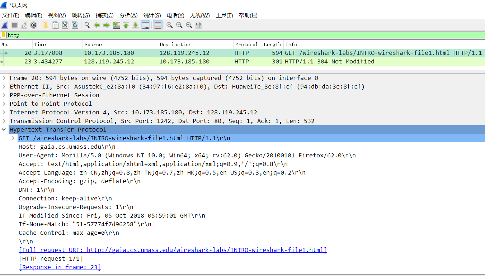

## 实验步骤
1. 打开wireshark，将出现接口列表。双击选择接口，程序将捕获接口的所有数据包。
2. 访问http://gaia.cs.umass.edu/wireshark-labs/INTRO-wireshark-file1.html
3. 使用过滤器，过滤除HTTP的协议

结果：

## Answer
1. TCP、TLSv1.2、DNS、DHCP
2. 时间为30.214796-29.945271=0.269525s
3. gaia.cs.umass.edu的IP地址为：128.119.245.12 本机IP为：10.173.185.180
4. [result.pdf](result.pdf)
