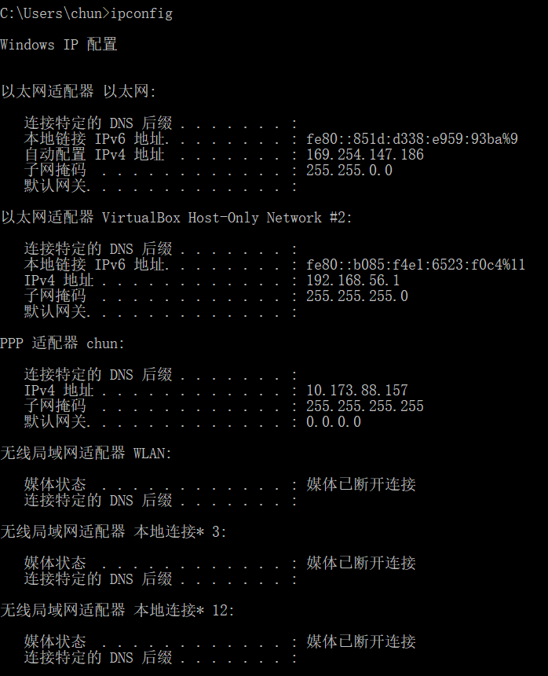

# nslookup
## 实验步骤
使用windows完成，首先清除DNS缓存
打开cmd输入
```
ipconfig /flushdns
```
1. 使用nslookup
在cmd中输入
```
nslookup www.douban.com
```
输出
```
服务器:  ns1.xidian.edu.cn
Address:  202.117.112.3

非权威应答:
名称:    www.douban.com
Addresses:  154.8.131.165
          154.8.131.171
          154.8.131.172
```
在cmd中输入
```
nslookup -type=NS douban.com
```
输出
```
服务器:  ns1.xidian.edu.cn
Address:  202.117.112.3

非权威应答:
douban.com      nameserver = ns3.dnsv4.com
douban.com      nameserver = ns4.dnsv4.com
```
使用-type=NS 选项，NS ：域名服务器记录（Name Server ），
返回保存下一级域名信息的服务器地址。

非权威应答是因为所查询的域名不使用你当前所用的 DNS 查询服务器上。

可使用如下命令查询
```
nslookup www.douban.com ns3.dnsv4.com
```
输出
```
DNS request timed out.
    timeout was 2 seconds.
服务器:  UnKnown
Address:  184.105.206.69

名称:    www.douban.com
Addresses:  154.8.131.165
          154.8.131.171
          154.8.131.172
```
2. 运行 nslookup 来确定一个欧洲的大学的权威 DNS 服务器
cmd输入
```
nslookup -type=NS mit.edu
```
输出
```
服务器:  ns1.xidian.edu.cn
Address:  202.117.112.3

非权威应答:
mit.edu nameserver = use5.akam.net
mit.edu nameserver = usw2.akam.net
mit.edu nameserver = asia1.akam.net
mit.edu nameserver = ns1-173.akam.net
mit.edu nameserver = use2.akam.net
mit.edu nameserver = ns1-37.akam.net
mit.edu nameserver = asia2.akam.net
mit.edu nameserver = eur5.akam.net

eur5.akam.net   internet address = 23.74.25.64
use2.akam.net   internet address = 96.7.49.64
use5.akam.net   internet address = 2.16.40.64
use5.akam.net   AAAA IPv6 address = 2600:1403:a::40
usw2.akam.net   internet address = 184.26.161.64
asia1.akam.net  internet address = 95.100.175.64
asia2.akam.net  internet address = 95.101.36.64
ns1-37.akam.net internet address = 193.108.91.37
```
3. 运行 nslookup ，使用问题 2 中一个已获得的 DNS 服务器，来查询 Yahoo! 邮箱
cmd输入
```
nslookup mail.yahoo.com
```
输出
```
服务器:  ns1.xidian.edu.cn
Address:  202.117.112.3

非权威应答:
名称:    ds-any-ycpi-uno.aycpi.b.yahoodns.net
Addresses:  2a00:1288:80:800::7000
          2a00:1288:80:800::7001
          87.248.118.23
          87.248.118.22
Aliases:  mail.yahoo.com
          fd-geoycpi-uno.gycpi.b.yahoodns.net
```
# ipconfig
## 实验步骤
输入ipconfig，得到下图


# 使用Wireshark追踪DNS
## 实验步骤
1. 使用ipconfig清空主机中的DNS缓存。
2. 清空浏览器缓存
3. 打开Wireshark，然后在过滤器中输入“ip.addr==your_IP_address”，您可以先使用ipconfig获取你的IP地址。此过滤器将删除既从你主机不发出也不发往你主机的所有数据包。
4. 在Wireshark中启动数据包捕获。
5. 使用浏览器访问网页： http://www.ietf.org
6. 停止数据包捕获。

输出：

[result.pdf](result/result1.pdf)

## Answer：
4. DNS协议都是在UDP协议之上的
5. DNS查询的目标端口和响应的源端口都为53
6. DNS发送到202.117.112.3，本机ip为 10.173.88.157，并不相同。
7. 响应为 www.ietf.org: type A, class IN，意思查询请求的 IP 地址，查询消息不包括任何的结果。
8. 三个answer
    ```
    Answers
    www.ietf.org: type CNAME, class IN, cname www.ietf.org.cdn.cloudflare.net
    www.ietf.org.cdn.cloudflare.net: type A, class IN, addr 104.20.0.85
    www.ietf.org.cdn.cloudflare.net: type A, class IN, addr 104.20.1.85
    ```
    分别是由国外 CDN 厂商 Cloudflare 提供的规范CNAME的CDN加速（type=cname ）地址，以及规范后 CNAME 的两个 IPV4 地址（type=a
9. 是相对应的
10. 没有，因为本地有 DNS 缓存，直接使用缓存了。
# 玩玩nslookup
## 实验步骤1
1. 使用ipconfig清空主机中的DNS缓存。
2. 清空浏览器缓存
3. 打开Wireshark，然后在过滤器中输入“ip.addr==your_IP_address”，您可以先使用ipconfig获取你的IP地址。此过滤器将删除既从你主机不发出也不发往你主机的所有数据包。
4. 在Wireshark中启动数据包捕获。
5. 使用浏览器访问网页： www.mit.edu
6. 停止数据包捕获。

输出：
[result.pdf](result/result2.pdf)
## Answer
11. DNS查询的目标端口和响应的源端口都为53
12. DNS 查询消息的目标IP地址为202.117.112.3，并不是默认本地DNS服务的IP地址。
13. TYPE=A （请求 IPV4 地址查询），TYPE=AAAA( 请求 IPV6 地址查询) ，查询消息不包括任何答案。
14. : 同样包括规范主机地址（type=cname ），规范主机地址指向 IPV4(type=a)和 和 IPV6（ （type=AAAA ）地址
15. 
    查询图：
    
    响应图：
    
## 实验步骤2
1. 使用ipconfig清空主机中的DNS缓存。
2. 打开Wireshark，然后在过滤器中输入“ip.addr==your_IP_address”，您可以先使用ipconfig获取你的IP地址。此过滤器将删除既从你主机不发出也不发往你主机的所有数据包。
3. cmd中输入nslookup -type=NS mit.edu
4. 停止数据包捕获。

输出：
[result.pdf](result/result3.pdf)

## Answer
16. 发送到的IP202.117.112.3，不是我本机的 IP
17. 有一个 TYPE=PTR(通过IP反向查域名)和一个TYPE=NS（查询权威 DNS ）请求，查询消息均不包含任何结果。
18. 域名服务器
    ```
    mit.edu: type NS, class IN, ns use5.akam.net
    mit.edu: type NS, class IN, ns ns1-37.akam.net
    mit.edu: type NS, class IN, ns eur5.akam.net
    mit.edu: type NS, class IN, ns asia1.akam.net
    mit.edu: type NS, class IN, ns ns1-173.akam.net
    mit.edu: type NS, class IN, ns asia2.akam.net
    mit.edu: type NS, class IN, ns usw2.akam.net
    mit.edu: type NS, class IN, ns use2.akam.net
    ```
    提供了 MIT 的权威 DNS 的域名，不在提供 MIT 的域名的 IP 地址。
19. 查询图：
    
    响应图：
    
## 实验步骤3
由于MIT 这个DNS服务器已经停用，直接用作者抓包结果

输出：
[result.pdf](result/result4.pdf)

## Answer
20. 发送到 IP 是 是 bitsy.mit.edu(18.72.0.3) 这个 DNS 
21. 有一个TYPE=PTR和两个TYPE=NS请求，查询消息均不包含任何结果。
22. 返回了一个answers，包含MIT的权威 DNS 的域名及他们的IP
23. 查询图：
    
    响应图：
    