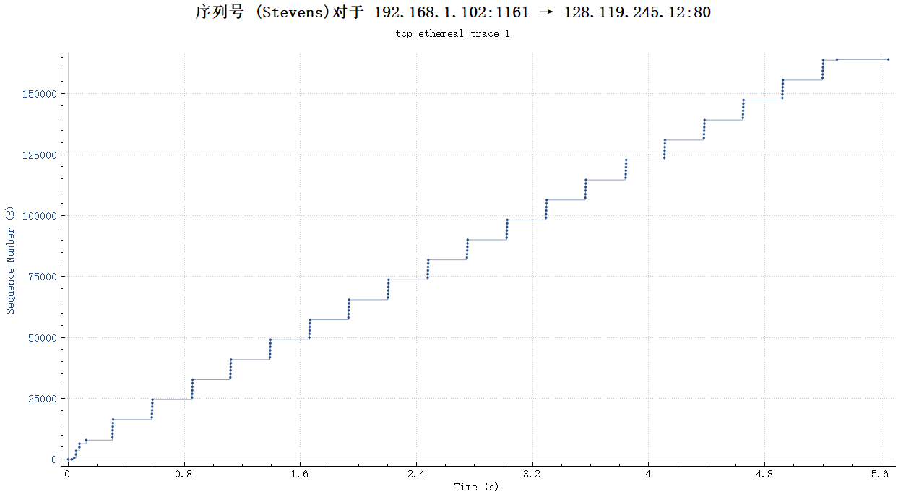

# TCP

## 捕获从计算机到远程服务器的批量TCP传输

### 实验步骤

1. 打开<http://gaia.cs.umass.edu/wireshark-labs/alice.txt>,并保存。
2. 打开<http://gaia.cs.umass.edu/wireshark-labs/TCP-wireshark-file1.html>，并选择第一步保存的文件准备上传，*注意：不要按上传按键*。
3. 启动wireshark，开始捕获。
4. 按下“Upload"按键
5. 停止捕获。

输出：

[result.pdf](result/result1.pdf)

## 跟踪包的初步观察

以下均使用作者的抓包结果回答问题

## Answer

1. 源IP：192.168.1.102，TCP端口：1161
2. 接受IP：128.119.245.12 TCP端口：80
3. 此为我的抓包结果：
    * 源IP：10.173.104.45 TCP端口：24627
    * 接受IP： 128.119.245.12 TCP端口：80
4. SYN是TCP/IP建立连接时使用的握手信号。SYN表示建立连接，FIN表示关闭连接，ACK表示响应，PSH表示有 DATA数据传输，RST表示连接重置。开始建立连接时将SYN set 为 1来请求建立连接。TCP三次握手的第一步。
5. 回复的SYNACK区段的序号（SEQ）为1（响应SEQ=客户端SEQ+1）。Acknowledgment的值为1，意思是服务器接受到连接请求，并且发送SYN-ACK确认，这是TCP三次握手的第二步。
6. 序列号（SEQ）为1.
7. 序列号、开始时间、接收时间、RTT和len

    * SEQ=1，send=0.026477s,rec=0.053937s,RTT=0.02746s,Len=565
    * SEQ=566，send=0.041737s,rec=0.077294s,RTT=0.035557s,Len=1460
    * SEQ=2026,send=0.054026s,rec=0.124085s,RTT=0.070059s,Len=1460
    * SEQ=3486,send=0.05469s,rec=0.169118s,RTT=0.114428s,Len=1460
    * SEQ=4946,send=0.077405s,rec=0.217299s,RTT=0.139894s,Len=1460
    * SEQ=6406,send=0.078157s,rec=0.267802s,RTT=0.0.189645s,Len=1460
8. 同上
9. 收到的最小缓冲区空间量为5840。缺少接收器缓冲区空间是会限制发送方传送 TCP 区段。若一方通知 window=0 ，另一端将不再发送数据，但会定时询问是否缓冲区是否可用，若不可用，则重置时间继续等是 待，若可用再发送。一般是 2 Byte=65535Bit。
10. 没有，序列号一直增大。
11. 通常确认60bytes。可以识别接收方每隔一个接收到的区段才发送确认的情况。
12. 吞吐量= 数据传输大小/ 所用时间。数据传输大小=164090bytes，所用时间=5.297341s，所以吞吐量=30975.918bps