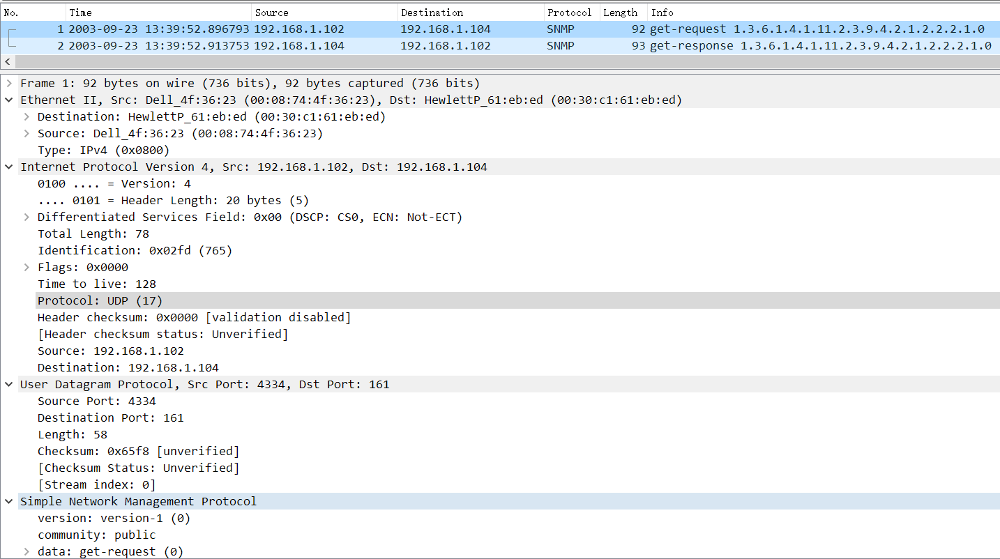

# UDP

## 实验步骤

与HTTP的第五个实验一致，以下均使用作者抓包结果

输出：

[result.pdf](result/result.pdf)



## Answer

1. 有4个字段，每个字段2bytes。以下为第一个包的UDP协议：

    ```c
    Source Port: 4334 // 源端口
    Destination Port: 161 // 目的端口
    Length: 58 // 长度
    Checksum: 0x65f8 [unverified] //校验和
    [Checksum Status: Unverified]
    [Stream index: 0]
    ```
2. 8字节
3. 长度字段为UDP头+数据长度。IP 长度=IP 头长度（20Byte ）+UDP 头长度（8Byte ）+UDP 数据，UDP 长度=UDP 头长度（8Byte ）+UDP 数据。
4. 负荷大小为2**16-8=65528（UDP的len字段为2bytes）
5. 端口号最大为2**16-1=65535（UDP的源端口号为2bytes）
6. Protocol: UDP (17) UDP协议号：17（10进制）或0x11（16进制）。
7. 发送者发送端口号在接收返回（响应）UDP 时候会变成接收端口号。接收者发送返回（响应）UDP 时候接受端口号会变成发送端口号